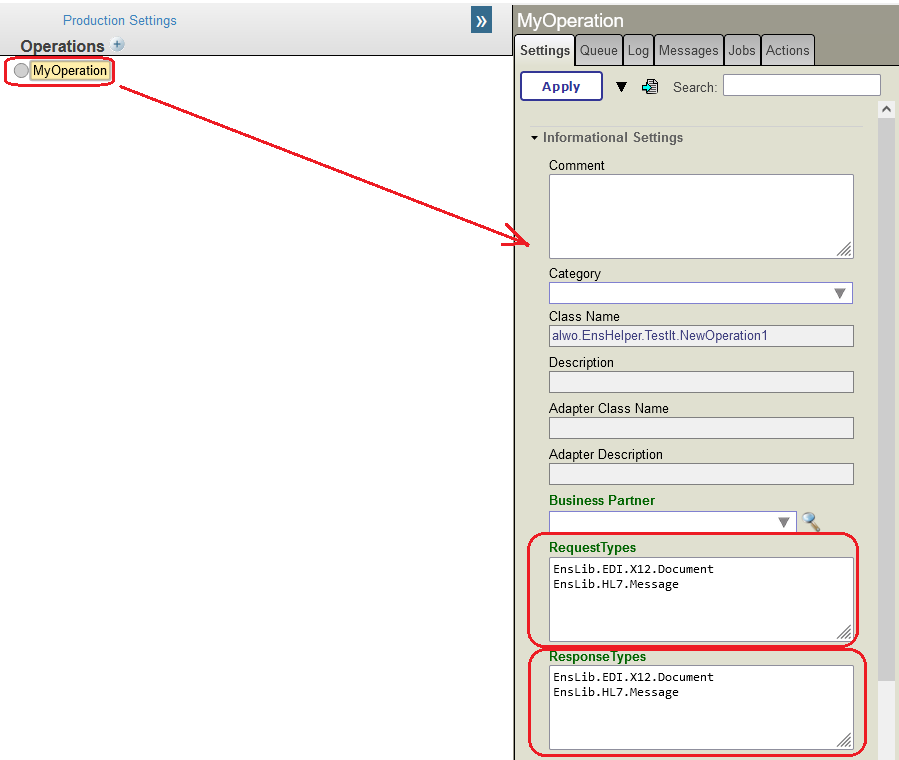

# EnsHelper
IRIS Integration Extensions and Utilities 

# Install
```
zpm install alwo-enshelper
```

# Class - HostRequestResponseInfo
Extend a custom BusinessService, BusinessHost or BusinessOperation.<br/>
When Instance Settings of a custom class are viewed in Production on Management Portal, this helper adds two new fields to the "Information" section.<br/>
These fields show the Request Message Types and Response Message Types, consumed and returned by the production instance.



## How to implement
To use simply add this class name to the Extends list in class definition of any custom Service, Process or Operation type<br/>

### Business Service

```objectScript
Class myService extends (Ens.BusinessService, alwo.EnsHelper.HostRequestResponseInfo)
{
  ...
}
```

### Business Process

```objectScript
Class myBusinessProcess extends (Ens.BusinessProcess, alwo.EnsHelper.HostRequestResponseInfo)
{
  ...
}
```

### Operation

```objectScript
Class myOperation extends (Ens.BusinessOperation, alwo.EnsHelper.HostRequestResponseInfo)
{
  ...
}
```
## DOCKER Support
### Prerequisites   
Make sure you have [git](https://git-scm.com/book/en/v2/Getting-Started-Installing-Git) and [Docker desktop](https://www.docker.com/products/docker-desktop) installed.    
### Installation    
Clone/git pull the repo into any local directory
```
$ git clone https://github.com/rcemper/DK_EnsHelper.git
```
Open the terminal in this directory and run:
```
$ docker-compose build
```
Run IRIS container with your project:
```
$ docker-compose up -d
```
Test from docker console
```
$ docker-compose exec iris1 iris session iris
USER>
```
or using **WebTerminal**
```
http://localhost:42773/terminal/
```

